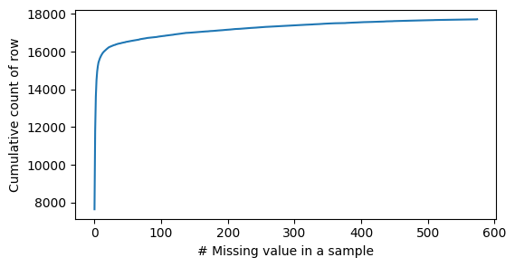

# Genomics importance for drug response

This repo contains the code to model of the relationship between gene features and the response to the intervention on cell line. Specically, the relatioship of the gene and intervention response are modelled to predict the relative importance of gene features for each intervention.

# Environmental setup

The code has been developed and tested in a python 3.8 docker environment. The docker file are given and can be run both locally and deployed to cloud.

To build the docker images, simply execute the shell script as follow:
```bash
./build_dockers.sh
```

** Note that the docker image built can be used locally or push to a container registery (eg: AWS ECR) for cloud deployment.  


Once the model is build, model can be trained and make inference to predict the output by executing the command below:
```bash
docker run -it -v "$(pwd)"/model:/code/model -v "$(pwd)"/results:/code/results drug4gene:0.1  
```

While there are many models to train,  the following command can be used to train a small model to test
```bash
docker run -it -v "$(pwd)"/model:/code/model -v "$(pwd)"/results:/code/results drug4gene:0.1  ./run_full_pipeline_small.sh
```

## Data
### Input data
There are two input data files in `./data`

1. `features.csv`
2. `dependency.csv`

`features.csv` is a data frame of genetic features along with the number of copy number variants for each cell line, where `0` is a loss of that genetic feature, `1` is a single copy, `2` is two copies and so on. 

`dependency.csv` is a data frame of ‘interventions’ and their associated response where `0` is no response and `1` is a positive response.

## Modelling approach: 

While the aim is to generate a ranked list of features importance for each intervention that causes a positive outcome in the cell line, the problem is first formulated as classification task which model the relationship of the genetic features and the intervention response and use the model interpretability tools to generate the features importance for the prediction. 

In order to select an approach to model classifier, exploratory data analysis is performed to understand the data. There are several challenges associated with the data: 
1. Limited sample : n=574
2  Large input features space. There are 58771 features and only 574 sample
3. High-dimensional output label space: 17724 output space
4. Extreme imbalance output label with rare classes hard to train and predict 
 

Given the limited sample and large input features, simple tree-based model is preferable over complicated neural network to model the relationship between the gene features and the intervention response. In addition, the high interpretability of a tree-based model to generate the feature importance also make it a better choise for the task. 

With the tree-based model in mind, random forest is chosen to model correlation between the genetic features and intervention response. Binary relevance approach which treat each intervention label as a single classfication problem is used to build a model to predict the relative feature importance for each intervention.

## Preprocessing steps
Before model, several processing step is taken to clean up the data. 
1. The missing value in both features and intervention dataframe is imputes with median value instead of dropping the feature entirely. This is mainly because the missing value is relatively small across sample as shown below.

missing value in feature dataframe| missing value in intervention dataframe
:-----------------------------:|:-------------------------:
 | 

2. Constant or quasi constant features with are remove. This step remove 

3. Highly correlated features with correlation coefficient more than 0.9 are drop (*The code has been implemented but not executed due to exceeding internal 8gb memory)

Given the highly imbalance label, the data is stratified split (if possible) to train and test dataset during the model training. And to evaluate the model performance, the accuracy and AUC-ROC for the train and test is recorded. 

# Results

## Classfier evaluation


### Output data

The output file can be found at `./results/output.csv`.which shows a ranked list of feature importance for each intervention that causes a positive outcome in the cell lines as follow


From the metrics above, it can be seen that the model capable of learning the relationship between the features and the output respnse.However, given the small sample, the random forest classifier are overfit with drop in both accuracy and AUC-ROC in the test dataset. However, proper evaluation should be done with K-fold to better quantify this

# Infrastructure design
To deploy the model to AWS, a simple terraform infrastructure code is provided in the `infrastructure` folder. Specically the code can be deployed to the AWS ECS which allow running Docker containers in a standardized AWS-optimized environment.The container will run on Amazon EC2 instance and can be scale easily by changing the infrastructure code. ECR is created to store the docker images and s3 is create to store the input, output and metadata. For security reason, VPC is provision with all the subnet, internet and route table created in `subnet.tf` is also specified in the terraform script to isolate the resources into a virtual network. 


# Future improvement
1. Feature engineering 
 - Remove highly correlated features
 - Remove features with low correlation with the label
 - Perform TF-IDF on the features and remove low importance features which exist across multiple sample

2. Modelling
 - Hyperparemter search can be performed to select the optimal hyperparameter and avoid overfitting
 - Ensemble model: Can improve the accuracy with trade-off between longer training and higher resourse to train and predict
 - Boosting tree such as XGBoost. Potentially improve the model although may increase the training time given the sequential boosting algorithm training.

 3. Feature importance measure
  - Impurity base feature importance could be misleading for high cardinality features and features permutation can be used to generate the feature importance as shown in here [link](https://scikit-learn.org/stable/auto_examples/ensemble/plot_forest_importances.html)
  - Other permutation method like SHAPley or LIME can also be used to measure the feature importance

4. Evaluation
 - Given the limited sampling, K-fold cross validation should perform to properly evaluate the model.

